# Configuring Endpoints

Once Command Center and the Senteon Agents are installed on their corresponding systems, endpoints for the Managed Account will populate in Command Center. From here you will be able to begin the Intelligent Setup process to apply policies to your endpoint fleet.

## Verify Status of Endpoints
Endpoints will be appear in the Managed Account Dashboard under the `Endpoints` tab once they have had the Senteon Agent installed and registered to the Managed Account.
> **Note**: If an endpoint doesn't appear in the list, verify that the Senteon Agent has been installed and registered to the proper Managed Account. If you have verified that installation was done properly, see [# Troubleshooting] for more guidance.

Follow the steps below:
1) Log into Command Center with your provided `Owner` user credentials.

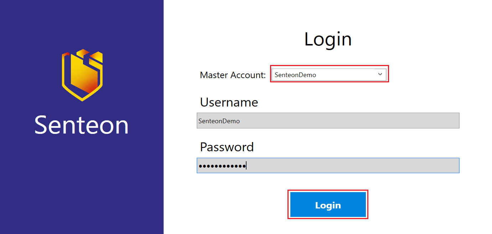

2)  Navigate to the `Account Manager` tab.

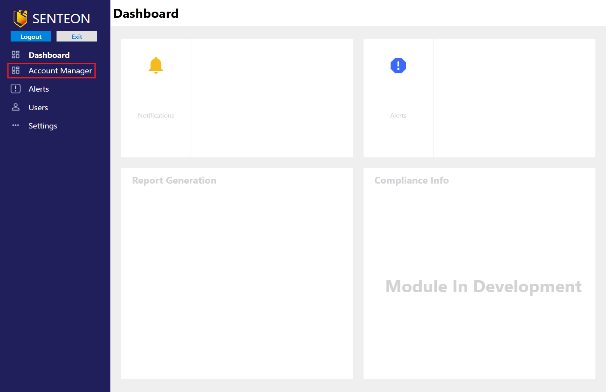

3)  Select the relevant Managed Account from the list provided and choose `Manage Account` to open a Managed Account Dashboard.

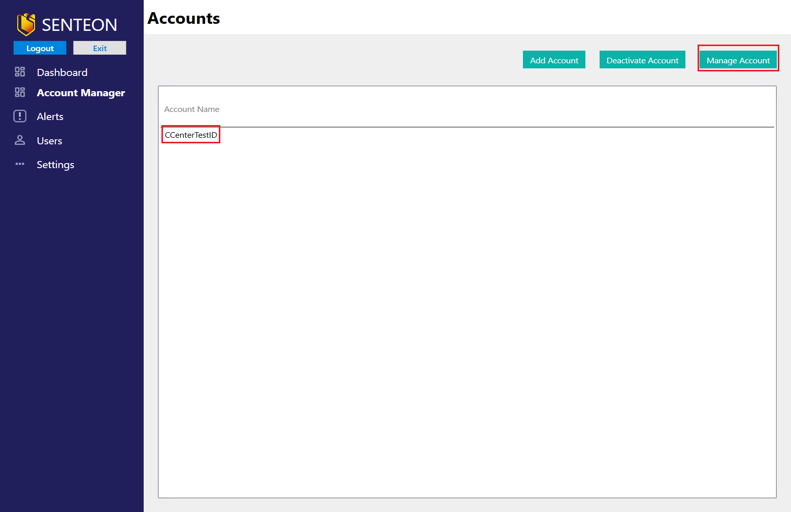

4)  Navigate to the `Endpoints` tab

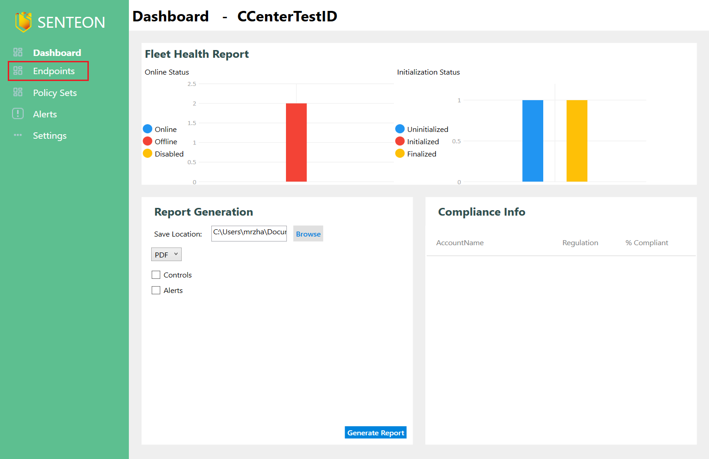

5)  The main `Endpoints` page shows all endpoints registered to the Managed Account

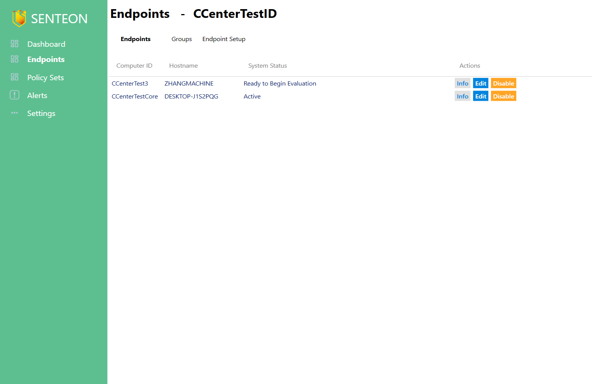

6)  Under a single endpoint, select the `Info` button to see detailed information about the endpoint.

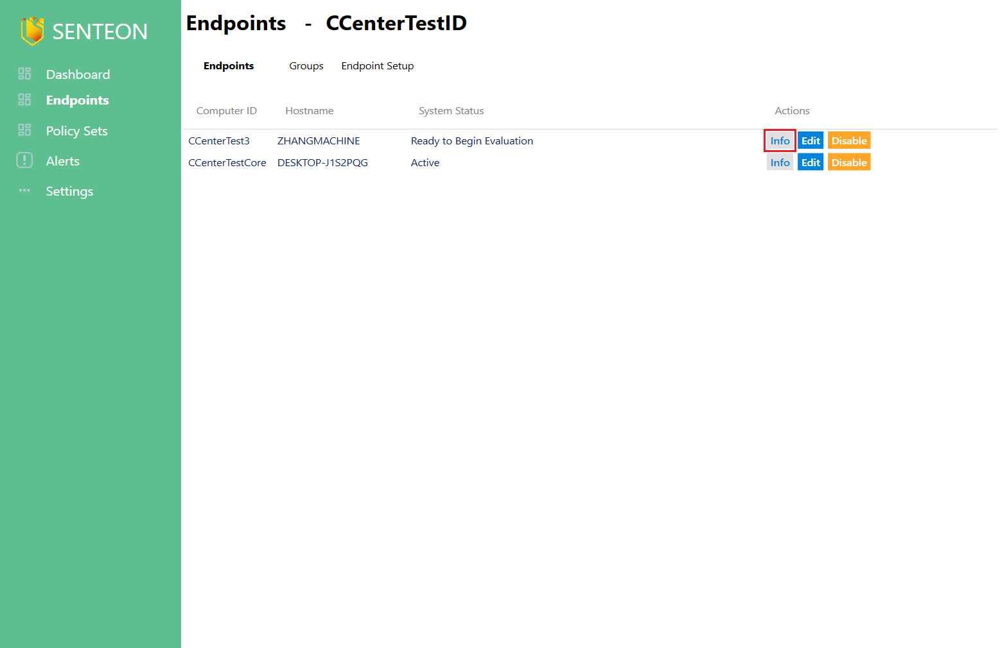
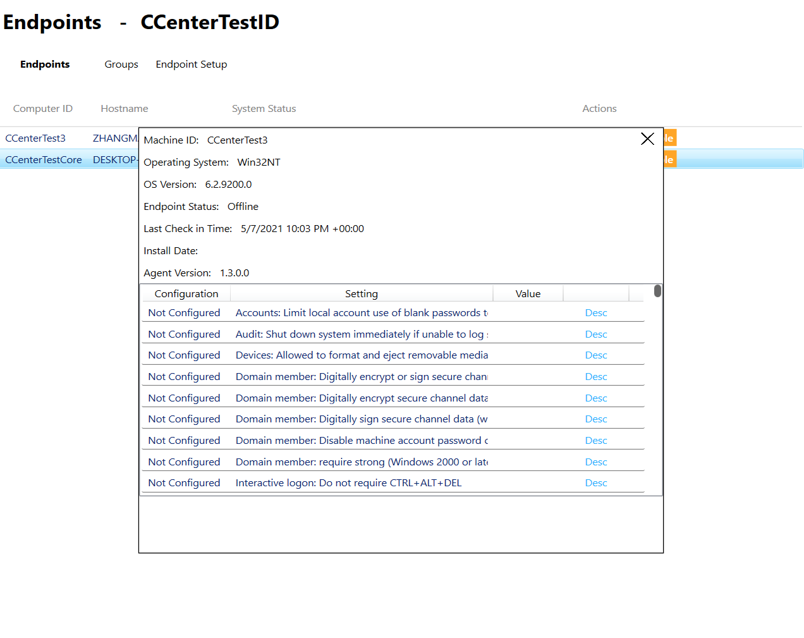

7) Once an endpoint's `System Status` is "Ready To Begin Evaluation", you are ready to continue.

## Intelligent Setup: Evaluation
1)  Navigate to the `Endpoint Setup` page.

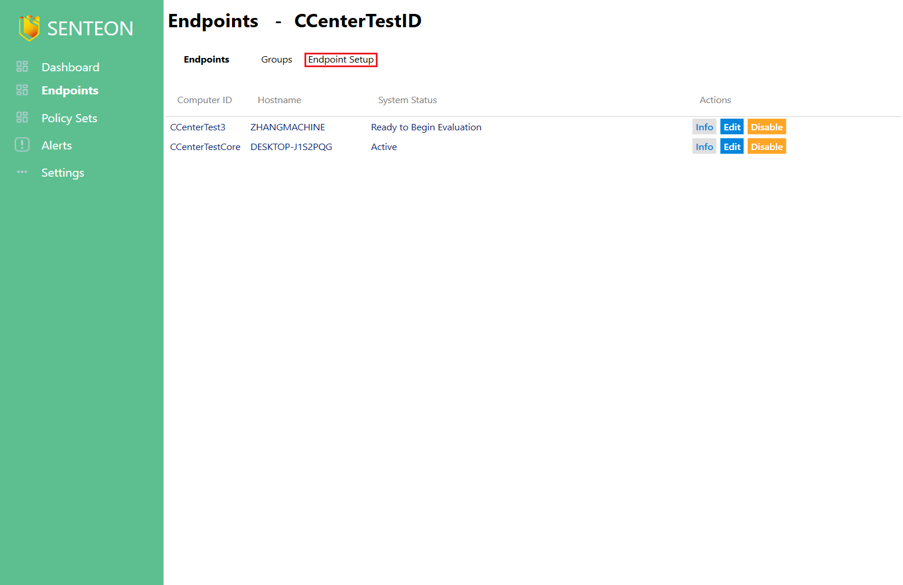

2)  The `Endpoint Setup` page has a section on the bottom left called `Ready For Evaluation` indicating all endpoints ready for to begin the Intelligent Setup process. Select the endpoints you wish to initialize from the list and then click the `Initialize Selected` button. This will begin the Evaluation Phase.
> **Note**: You can initialize as many endpoints at once as you would like. When the grouping feature is released, endpoints that are initialized together will be added to the same group and evaluated against the same baseline.
 
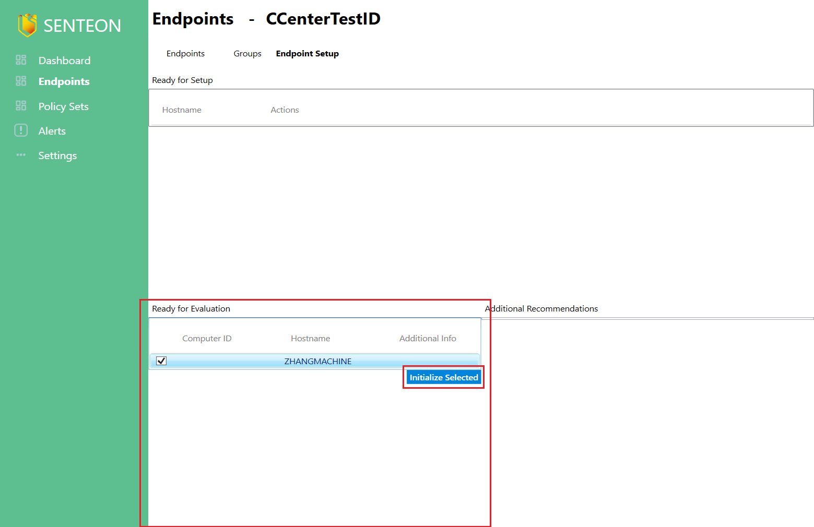
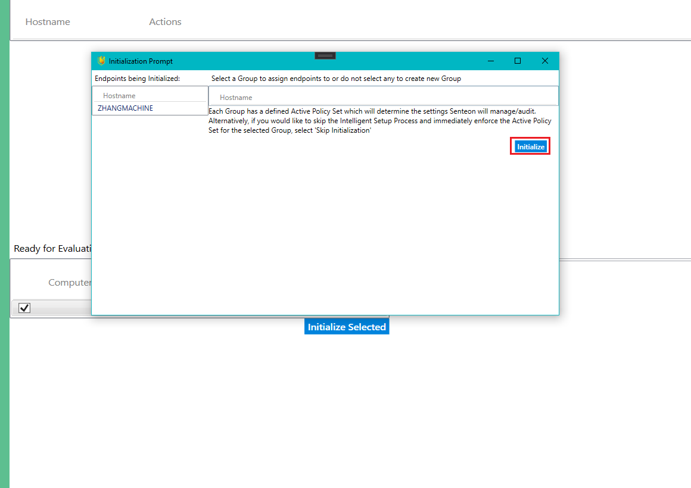

3)  During the Evaluation Phase, endpoints will be analyzed to determine which controls can be safely implemented without disrupting user experience and network operations.
> **Note**: ThE Evlauation Phase is configured to take as long as the Senteon Agent needs to agther data and make determinations. With future updates this time is expected to be around 2 weeks. For the purposes of the beta, this time period has been bypassed and endpoints can be setup immediately.  

4) Once an endpoint completes the Evaluation Phase, its `System Status` becomces "Ready For Setup". Clicking the `Refresh` icon will show the endpoints that have completed the Evaluation Phase. Once your endpoints appear in the list, you are ready to continue.

## Intelligent Setup: Setup Wizard
1) On the `Endpoint Setup` Screen, all endpoints ready for setup with be listed in the top list.

2) Select the endpoint you would like to setup by selecting the setup button next to the relevant endpoint.
> **Note**: It is currently not possible to setup endpoints in groups due to the nature of the Senteon Agent providing unique telemetry for each endpoint resulting in differing analysis based on the endpoint's activity. Senteon will be supporting quick setup for a high volume of endpoints by providing the ability to automatically enforce the baseline of an existing endpoint onto selected endpoints as necessary. This feature will be available on release with Groups functionality. 

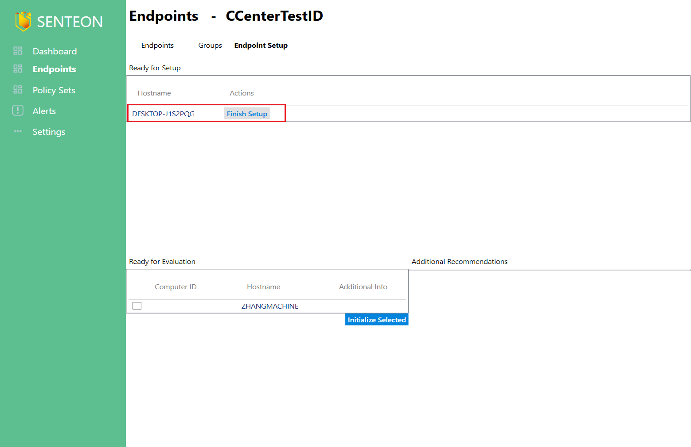

3) For the purposes of the Beta, all controlsets are currently being accepted without conflicts. With proper application, questions targeted at specific controls that an endpoint is found to have issues with enabling will be posted to the client with unique telemetry to allow for an educated decision to be made by the administrator. 
> **Note**: The very first endpoint setup for a managed account will have an extended wizard used to answer managed account specific questions that will apply to all controls within a managed account organization. 

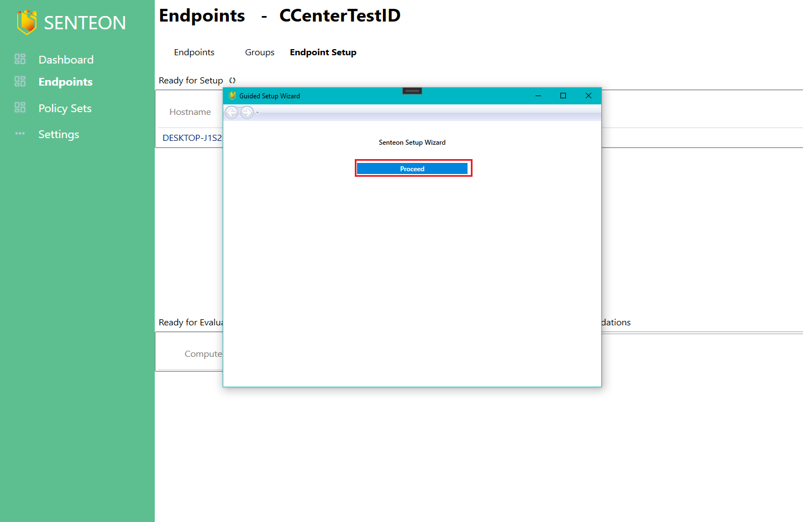

4) Once the setup is completed, Endpoint will begin to apply controls based upon the specified configurations. Its status in the `Endpoints` page will now be listed as `Active`. 

This dashboard will allow you to view endpoints registered under that Managed Account as well as reset controls for those endpoints. More information on resetting can be found in [Resetting Systems](resetting.md).
