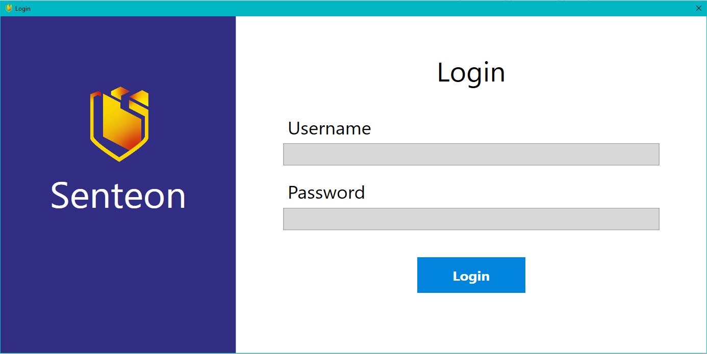
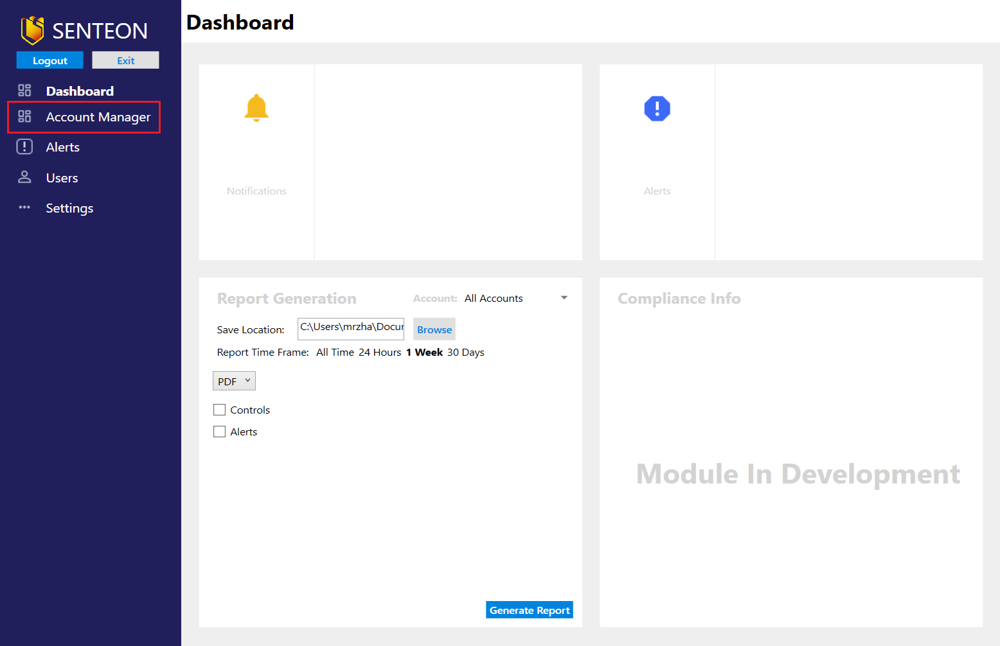
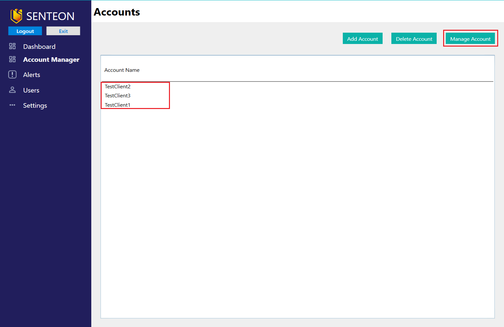
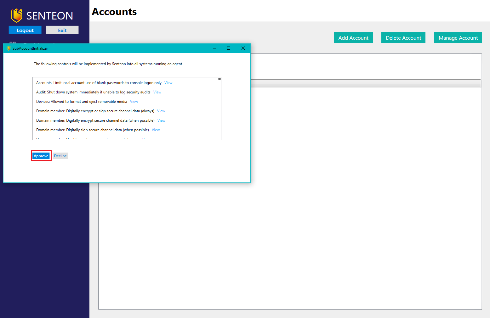
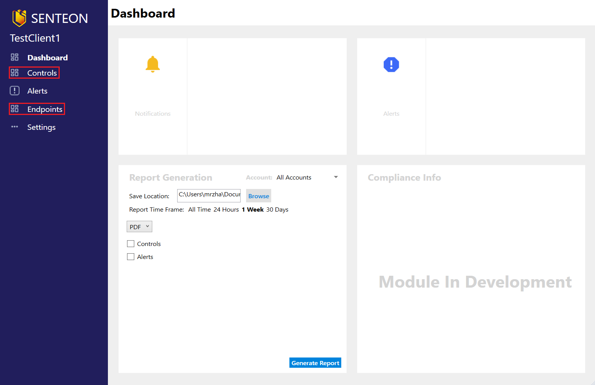

# Setting Controls

Once Command Center and the Senteon Agents are installed on their corresponding systems, controls can be applied through the Senteon Command Center dashboard. 

## Verify and Apply Control Set
1) Log into Command Center with your provided administrator credentials

2)  Navigate to the `Account Manager` tab.

3)  Select the relevant managed account from the list provided and choose `Manage Account`.

> **Note**: This will bring up a list of all the controls that will be applied to systems running a Senteon Agent with that Managed Account ID (Name).
 

4)  After verifying all of the controls, click the `Approve` button to apply them to the registered endpoints.

## Manage Your Endpoints

Once controls have been approved, a Managed Account's dashboard can be accessed through the `Account Manager` tab by selecting the name and clicking the `Manage Account` button.

This dashboard will allow you to view endpoints registered under that Managed Account as well as reset controls for those endpoints. More information on resetting can be found in [Resetting Systems](resetting.md).
