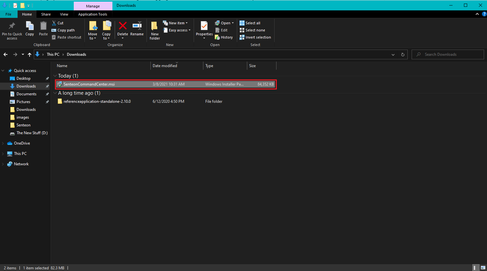
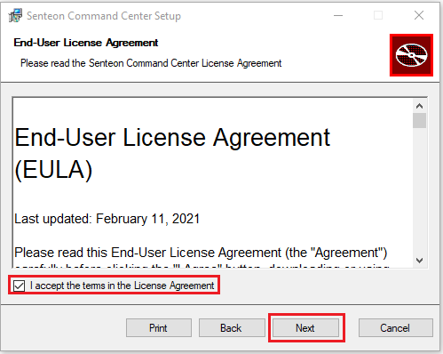
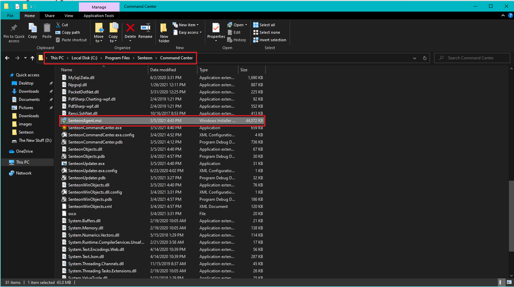
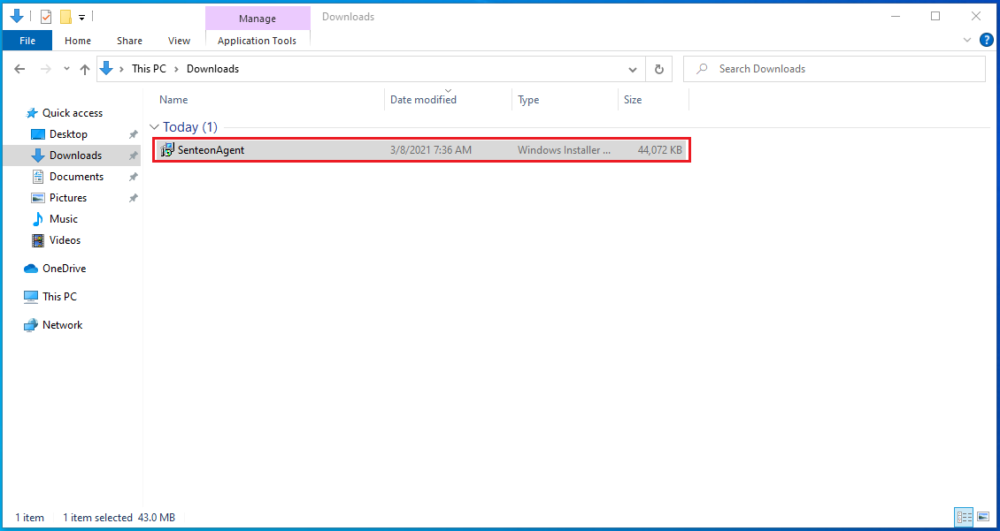
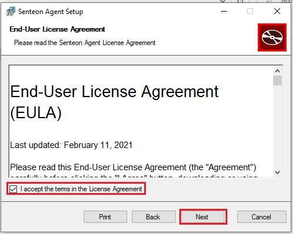
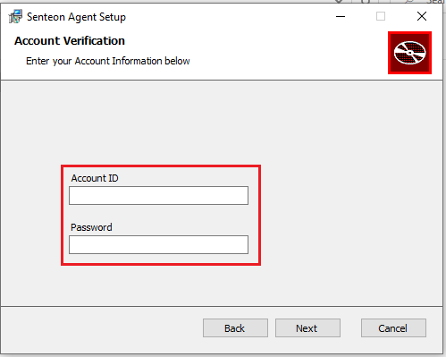

# Getting Started 
## Beta Build

On this page you can find instructions for installing and logging into the beta build of Senteon Fortify

Instructions for utilizing available features can be found here:
  - [Setting up Controls](controls.md)
  - [Resetting Systems](resetting.md)
  - [Generating Reports](reports.md)

### Terminology
| Term                   | Description                       |
|:----------------------:|:----------------------------------|
| Senteon Command Center | The central administrator console |
| Senteon Agent          | A small program installed on each endpoint that performs actions   and communicates back to Command Center |
| Managed Account        | An account that agents/endpoints are registered to and managed from |

## Installation

For the purposes of the beta, Senteon has provided you with:
- Installer for Senteon Command Center
- Credentials for Senteon Command Center
- Credentials for Managed Account

> **Note**: In full release, you will be able to create new Managed Accounts through Command Center. 

### Command Center

1) Load up `SenteonCommandCenter.msi` onto the machine that is intended to be used as the central console and execute (double-click). 

2) Accept the Senteon End-User License Agreement and select `Next`.

3) Accept the UAC prompt that appears in the taskbar.

After Command Center has finished installing, it can be accessed by searching "Senteon Command Center" in Windows Search or directly at `C:\Program Files\Senteon\CommandCenter\SenteonCommandCenter.exe`.

### Senteon Agent

Inside the Command Center install directory (`C:\Program Files\Senteon\CommandCenter\` by default), there will be an additional .msi installer for the Senteon Agent called `SenteonAgent.msi`. This installer should be distributed and installed onto all systems that you intend to manage. 

**To install you will need:**
| Requirement      | Description                                                      |
|:----------------:|:-----------------------------------------------------------------|
| Account ID       | ID/Name of Managed Account you wish to register the agent/endpoint to |
| Account Password | Password for Managed Account                                     |

**Steps**
1) Load up `SenteonAgentInstaller.msi` onto the endpoint you want to manage and execute (double-click). 

2) Accept the Senteon End-User License Agreement and select `Next`.

3) Choose the folder where you want to install (`C:\Program Files\Senteon\SenteonAgent` by default)

4) Enter the credentials for your Managed Account registered in Command Center

5) Accept the UAC prompt that appears in the taskbar.

After the installation is complete, the "Senteon Agent" service will be running on the endpoint. This service is configured to automatically restart if the computer is rebooted.
