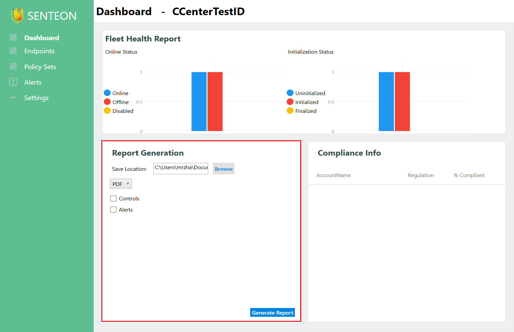

# Generating Reports

> **WARNING:** Currently reports will not generate any data as they are reliant on the Grouping system (available on release) to provide data on endpoint compliance with the Senteon Recommended Policy Set.

Reports can be generated from the Managed Account Console `Dashboard` tab.

Simply choose whether you would like a CSV or PDF style report, where the report should be generated, and what information you want on the report then select `Generate`. 

The resulting report should be output to the specified directory (Logged in user's `Documents` directory by default) and should open automatically with the default PDF application for the user.
