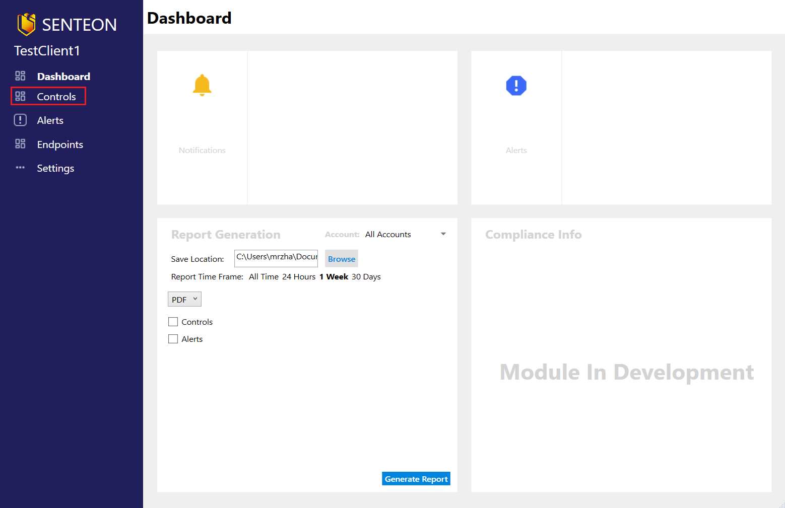
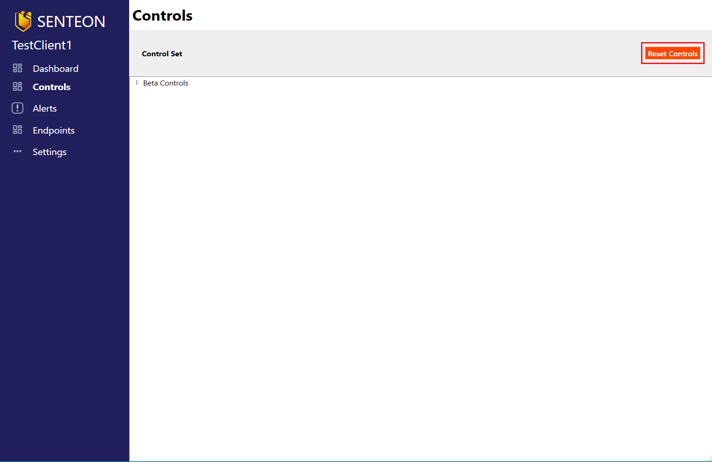

# Resetting Controls

This will cause all configurations on endpoints registered to that Managed Account to revert back to the settings they had before Senteon controls were applied. 

## Reset Controls ##
1. From a Managed Account's dashboard, navigate to the `Controls` tab.

2. Select the `Reset` button from the top right. 

