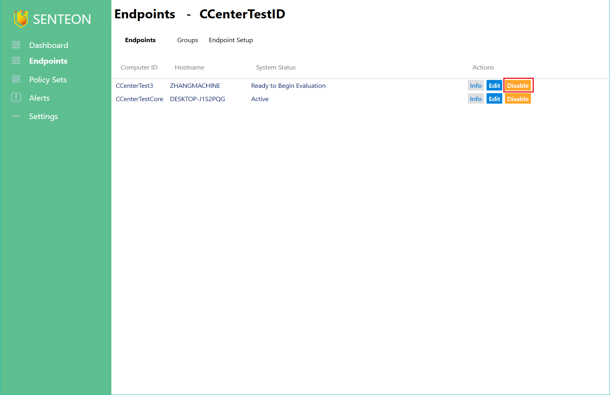

# Resetting Controls

This will disable a Senteon Agent and cause all configurations on the endpoint to revert back to the settings they had before Senteon controls were applied. This will put the agent in the proper state to be uninstalled, but can be re-enabled again at any time. 
If an Agent is directly uninstalled, it will go through the disabling process on its own. 

## Reset Controls and Disable Endpoint ##
1) From a Managed Account's dashboard, navigate to the `Endpoints` tab.

2) Select the `Disable` button next to the endpoint you wish to disable. 

## Re-Enable Controls and Re-Enable Endpoint ##

1) From a Managed Account's dashboard, navigate to the `Endpoints` tab.

2) Select the `Re-Enable` button next to the endpoint you wish to disable. 

To uninstall the agent, simply uninstall using the Windows built in application removal functionality. 
