# Configuration Sets
Configuration sets are groups of settings defined by Senteon as required or important for endpoints to have enabled or managed to ensure a strong security posture. Without Senteon, these settings would typically be managed and controlled through the local Group Policy console on the endpoint. Senteon utilitizes these defined configuration sets by associating them with groups to ensure that all endpoints within a group all remain consistent with each other. 

## Setting Information
Every setting within a configuration set can be viewed to see the setting's GPO path as well as its underlying value (registry, auditpol, secpol, etc). Information panels also include descriptions that have an explanation of the setting, rationale for why it should be configured, the impact of configuring the control, and its default and preferred configuration values. Finally, any compliance or severity value will also be listed here. 

  
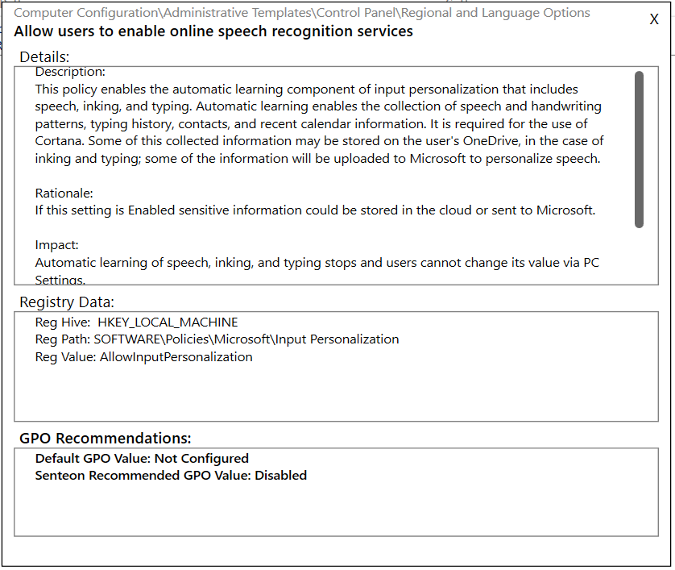
  

## Changing Configurations
Changing setting configurations with a configuration set can be done through multiple methods detailed under the endpoints and groups sections below. It is, however, worth noting that regardless of how configurations are changed and adjusted. they are always associated with groups and not with endpoints directly. As a result, when settings are changed on an endpoint, users will be prompted to move the endpoint into another group with a matching configuration set or create a new exception group with the intended condfiguration set. 

Configuration settings are always changed using a modify window that will display the setting as well as its preferred value and any alternate acceptable values it has. Any place where configurations can be edited will have access to the modify window.

# Endpoints
Once a Senteon Agent is installed, it will fingerprint the system it is installed on and register itself with the Senteon Servers and display an entry on the endpoint listing for the managed account. This information can be refreshed at any time using the refresh button located next to the endpoints and groups tabs.

  
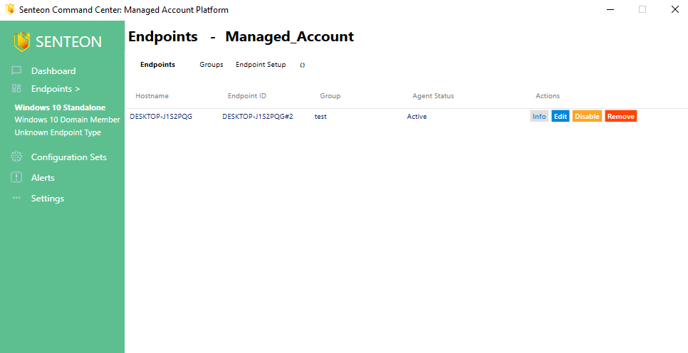
  

## Endpoint Listing
Endpoints listed on Senteon Command Center will show up on the list of endpoints under the Managed Account Endpoints tab with the following information:
|   Setting    | Description |
|:-----------:|:-----------:|
| Hostname | The hostname of the endpoint that this agent is installed on |
| EndpointID | A unique identifier generated by Senteon using the endpoint's hostname to ensure every endpoint will be displayed separately |
| Group | The current group that the endpoint belongs to and is deriving its configuration set from |
| Agent Status | the current status of the Agent on the endpoint. Information about the different status can be found in [Endpoint States](#endpoint-states) |
| Command Buttons | Depending on the current status of the agent, different activities can be taken on the endpoint. These options can be found in [Modifying Endpoints](#modifying-endpoints). The option to view an endpoint's specific information will always be available here. |
## Endpoint Information
When in-depth information on an endpoint is needed, the info button can be selected from the relevant endpoint. This page will load the following set of information specific to the endpoint:  
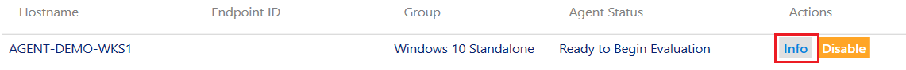  
|   Setting    | Description |
|:-----------:|:-----------:|
| Hostname | The hostname of the endpoint that this agent is installed on |
| Operating System | The current operating system of the endpoint the agent is installed on |
| OS Version | The current OS Version that the endpoint is on |
| Connection Status | The current connection status of the endpoint. This will display whether the endpoint is online or offline based on when the last time the endpoint checked in with the master server is.  |
| Last Check in Time | The last time the endpoint checked in with master server. This should occur on standard intervals and a long period without check in may be an indicator that the endpoint is currently experiencing issues |
| Install Date | This value indicated when the agent was installed on the endpoint.  |
| Agent Version | The current version of the agent that is installed on the endpoint. Agents should automatically update themselves, and outdated agents are an indicator of an issue with the endpoint  |
| Group | The current group that the endpoint is in |
| Endpoint Config Status | The current status of the endpoints configurations. If any settings have been found to be drifted this value will indicate that the endpoint has drifted. If there are no current issues the status will indicate that the endpoint is compliant |
| Endpoint Configuration Listing | These listing will show the current configuration settings on the endpoint along with their current value and current target values. Using the radio buttons, this list can be adjusted to display only the settings that have drifted from their current target settings. Specific information about each control can be viewed by selecting the view button for the relevant setting |

  
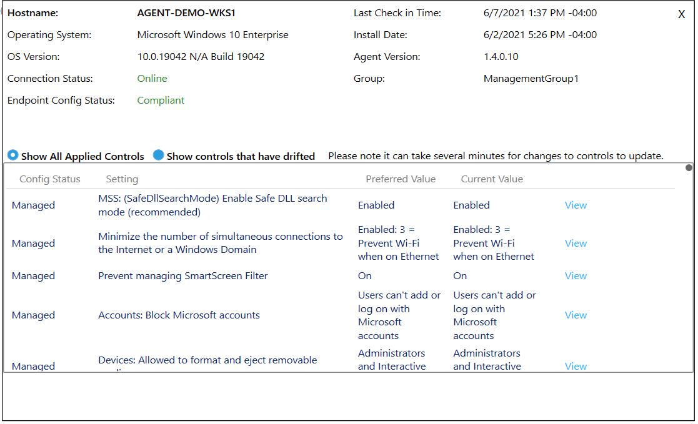
  

## Modifying Endpoints
Endpoints can be modified through the listings page via the command buttons. These buttons are only available when the endpoint agent status is appropriately configured. 
All of the possible commands are:
|   Command    | Availability | Usage |
|:-----------:|:-----------:|:-----------:|
| Info | Always Available | Displays info specific to the endpoint including its current configuration status, Operating system, and a list of applied configurations |
| Edit | When agent is Active | Provides the ability to work with the group and configuration sets associated with the endpoint. More information can be found under [modifying Endpoint Configurations](#modifying-endpoint-configurations)  |
| Disable | When the endpoint is active, ready for setup, ready for evaluation, evaluating, or creating temporary endpoint profile | disables the agent on the endpoint and reverts the endpoint settings to their original settings before the Senteon Agent had any impact on them. This is automatically done when an endpoint is uninstalled |
| Enable | When an endpoint is Disabled | Enabling a disabled endpoint will revert an agent back to its status before it was disabled |
| Reset | When an endpoint is Disabled | Reset an agent to allow for a reevaluation of an endpoint |
| Remove | When an endpoint has been uninstalled | Removes the endpoint from the database after uninstall |

## Modifying Endpoint Configurations
Endpoints can have their configuration sets modified in two ways. Both methods are available through the `Edit` button on active endpoints in the Endpoints page. Endpoints can modify their configuration sets by either changing the current group they are in, or through direct modification of settings, which will move them to a matching group or create a new exception group. 

  
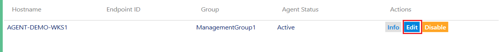
  

### Changing Groups
The endpoint change groups page shows off the endpoint's current group as well as all other available groups you can move the endpoint into. 

  
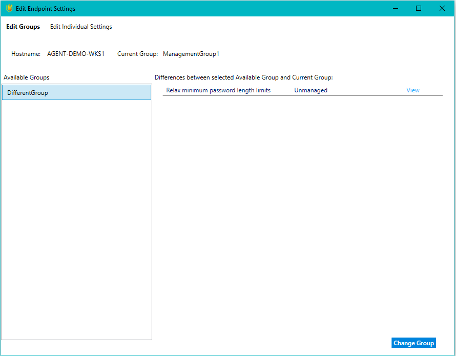
  

When a group is selected, all of the settings that are different between the two groups will be displayed. The value displayed for those settings will be the current value of the new group that the endpoint's current group is being compared to. 

If the Senteon User wishes to move the endpoint to the new group, keep the new group selected and then select the `Change Group` button.

### Changing Settings
The endpoint change controls page shows the endpoint's current configuration set that is taken from its current group. individual settings can be adjusted on this page. 

After the settings have been changed, the configuration set can be updated by selecting `Save Controls`. Senteon will determine if there is any groups with a configuration set matching the newly created set. If so, the Senteon User will have the option to move the endpoint into the existing group. If they choose not to, a new exception group will be created. 

  
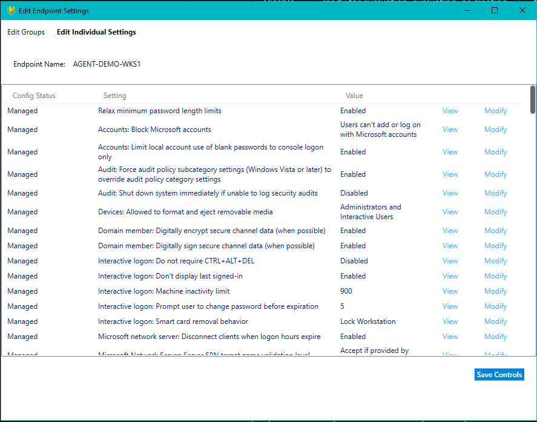
  
## Endpoint States
The Senteon Agent reports its current status to Command Center whenever it is updated. This status indicates the current state that the agent is in. All of the possible states that the agent can be in are detailed here:

|   State    | Description |
|:-----------:|:-----------:|
| Uninstalling | The agent is uninstalling from the endpoint. Once an endpoint is listed to be uninstalling, it is safe to remove from the database |
| Disabled | The agent is fully disabled and is not impacting the endpoint. Endpoint configuration is set to the state it was in before Senteon was installed |
| Disabling Endpoint | The agent is in the process of disabling itself and resetting endpoint settings back to the state they were in prior to the Senteon Agent |
| Active | The Senteon Agent is currently online with an applied configuration set and actively monitoring for drifts from the baseline  |
| Ready for Setup | The Senteon Agent has finished evaluating the endpoint and is ready to be setup with the guided wizard |
| Evaluating | The agent is currently in the process of evaluating the endpoint and determining the suggested baseline configuration set  |
| Ready to Begin Evaluation | The Senteon Agent has been successfully installed and is ready to begin evaluation of the endpoint |
| Creating Temporary Endpoint Profile | The Agent is currently in the process of installing and first time setup |

# Groups
Groups are utilized to keep endpoints consistent with the same baseline. Each group has a configuration set associated with it that is used by all endpoints within the group. Groups must have endpoints of the same types within them. Endpoint types are defined by Senteon when they have different full configuration sets. Examples include `Windows 10 Standalone`, `Windows 10 Domain Joined`, and `Server 2016 Non-DC`. This endpoint type is determined when the Agent is installed and will be listed as the endpoint's group until it is placed in a created group during evaluation. There are two different types of groups available for creation:

|   Group Type    | Description |
|:-----------:|:-----------:|
| Management Group | Management Groups have all settings available for the endpoint type and should be used for general baselines that include the majority of endpoints |
| Exception Group | Exception Groups are created underneath a management group and only have the settings that are configured to be different from its parent management group. These groups should be used when Endpoints have configuration sets that are slightly different from the management group. |

## Group Info
Info for a specific group can be accessed by selecting the `view` button next to the relevant group.
Group info for Management Groups will display the current endpoints that belong to the role, the current configuration set for the role, and the exception groups underneath that management group. 
Group info for an Exception Group will display the current endpoints that belong to the role, the current configurations set that are different from the management group, and its entire effective configuration set with the management group's controls included. 

The Group info page also includes a button used to generate a report specific to the group. To learn more about reports, please reference the [reports page](reports.md)

## Group Modification
There is a multitude of ways to affect a group and its configuration sets that are dependent on the type of group. The different types of methods to change group configurations are detailed below. 

### Moving Endpoints
Endpoints can be directly moved between groups through the `Edit Groups` window. Groups will list all endpoints within the group and all endpoints outside the group. An endpoint can be moved into a group and out of a group from any group window. 

  
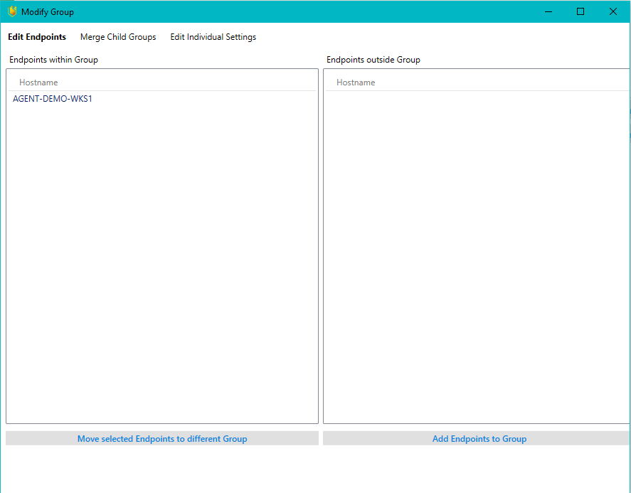
  

### Making Exception Groups
Exception Groups can be made using the `Create Exception` button available to Management Groups. Creation of an Exception Group allows the Senteon User to select endpoints within the Management Group to move to the Exception Group and change settings are necessary.

  
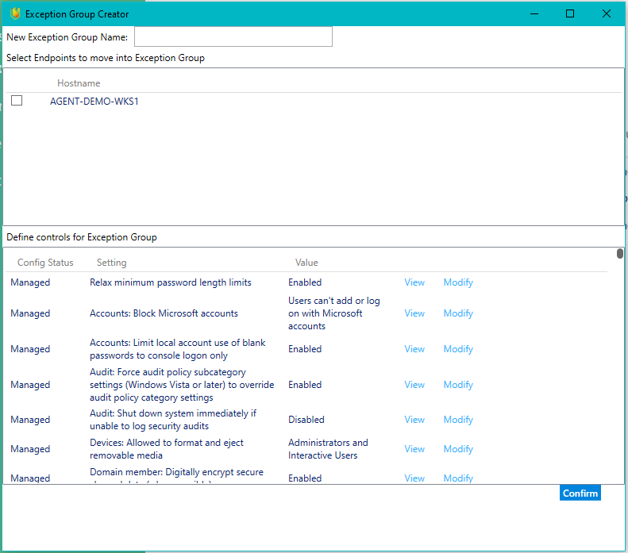
  

### Merging Exception Groups
When an Exception Group is no longer necessary, Senteon Users can merge the Exception Group back into its Parent Management Group and return the endpoints back to the Management Group. This is done through the `Edit Groups` Window when accessed for a Management Group. 

  
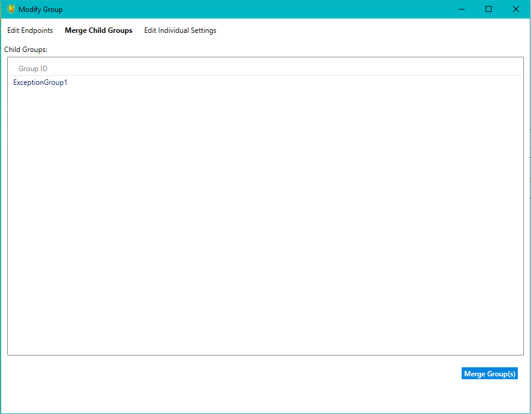
  

### Converting Exception Groups
In some situations, Senteon Users may decide they want to convert an Exception Group into a standalone Management Group. This is done using the `Convert to Mgmt Grp` button available to Exception Groups. Doing so will turn the Exception Group into a Management Group with the same name, effective configuration set (its former parent Management Group's configuration set + the groups own differences), and all endpoints previously part of the Exception Group. 

### Individual Setting Modification
To modify specific settings for a group, access the individual setting tab in the `Edit Groups` window. For Management Groups, settings can be directly modified and saved here. For Exception Groups, Settings associated with the exception group can be directly modified here. Other settings can be added to the exception group and modified here as well using the `Add Settings` button. Settings can also be removed from the Exception set using the `Remove Selected Setting from Exception` button. 
  
Management Group:  
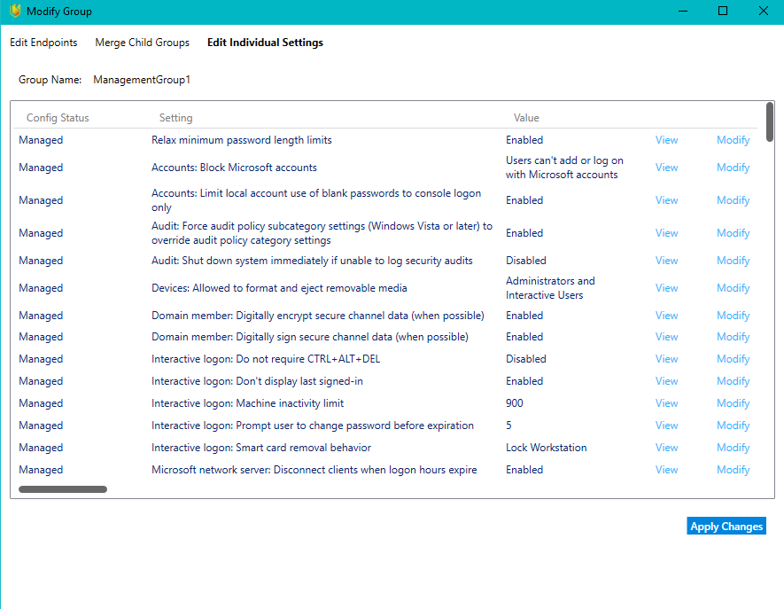
  
Exception Group:  

  
### New Management Group Creation
Management Groups can be created from the Groups page. When doing so, the group's name and configuration set can be defined and endpoints can be moved into the group as it is created through the Group Creation Form.
  
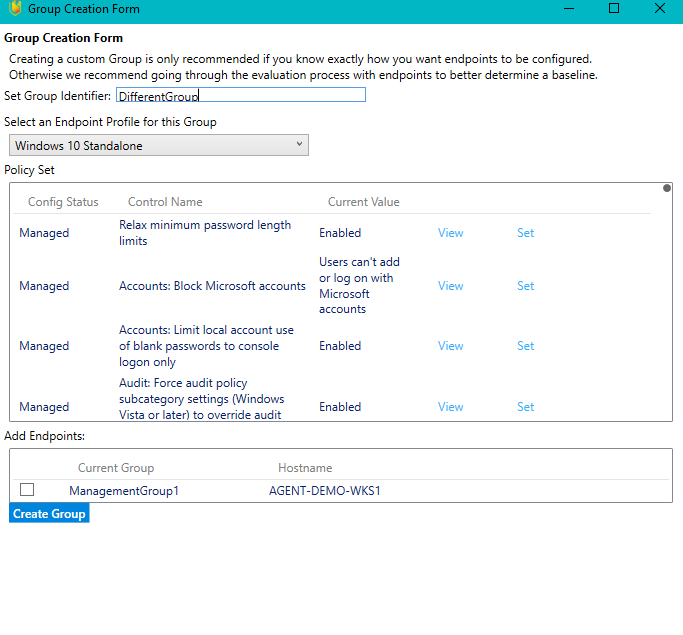
  
# Setup
When endpoints have a Senteon Agent installed, the Senteon Agent will register itself with Command Center so that it can be evaluated and finalized. Starting Evaluation will allow the Senteon Agent to audit all of the settings related to that endpoint type and determine the ideal baseline for the endpoint. After evaluation is complete, the endpoint can be setup with the wizard. The Setup wizard contains questions relating to settings that the Agent could not make determinations for due to organizational/cultural restrictions. Specific choices that can be made during evaluation and setup are detailed below. 

## Evaluation
Evaluation can be started on one or more endpoints simultaneously through the Endpoint Setup page. 
  
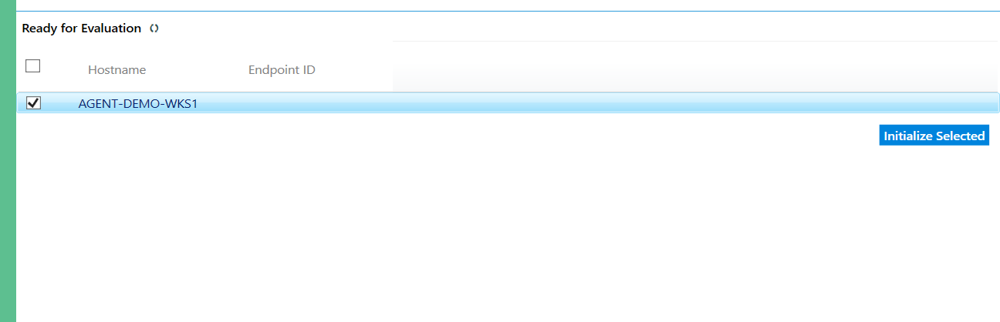
  
When endpoints are selected for evaluation, one of three options can be chosen. Endpoints can either be placed into a new group and evaluated, placed into a pre-existing group and evaluated, or evaluation and set up can be skipped entirely and an existing configuration set will be immediately applied. 
  
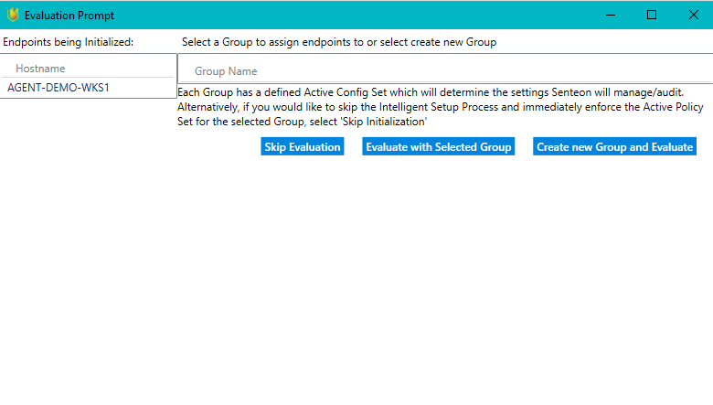
  
Adding the Endpoint to an existing group will utilize the group's pre-existing configuration set as a baseline and ignore settings that are already not configured for the group. 

## Setup Wizard
Setup must be done for endpoints one at a time. When the setup wizard begins, the Senteon User can choose to skip the wizard and immediately setup the wizard with the configuration set of its current group regardless of the conflicts found in the wizard. Otherwise, the wizard will run through a set of questions that detail specific issues related to settings and provide endpoint specific data for settings that have findings. Senteon also provides an explanation as to the importance and potential impact caused by these settings to help Senteon Users make clear informed decisions. Some settings decisions are considered to be organization wide, and will only be queried once. Once a decision as been made, these settings will be accessible for the Managed Account settings for modification. 
  

  

Example Wizard Page:  

