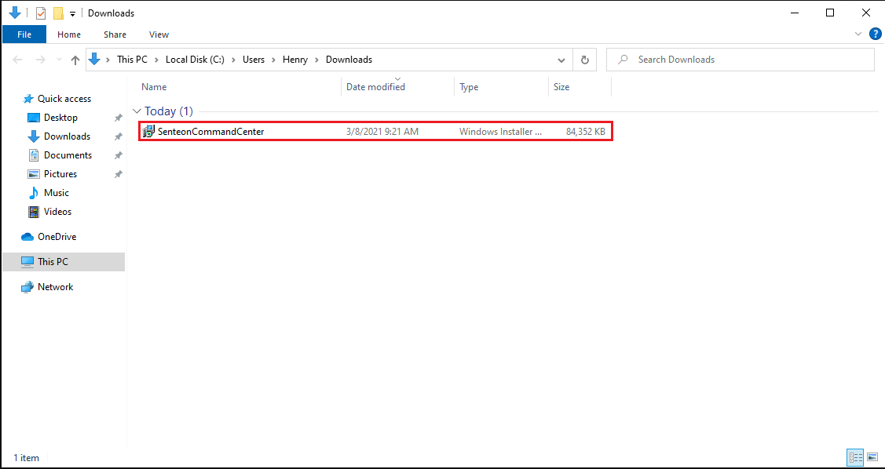
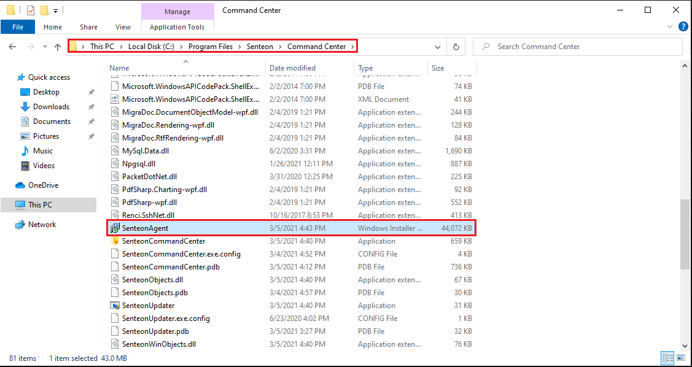
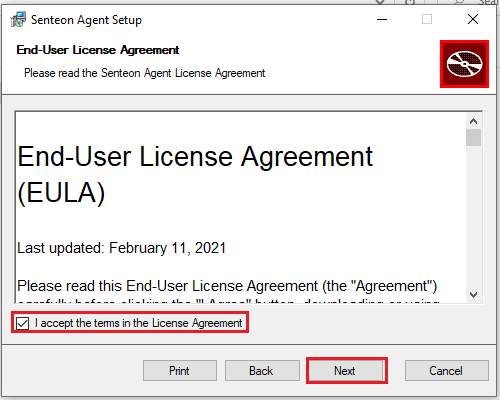
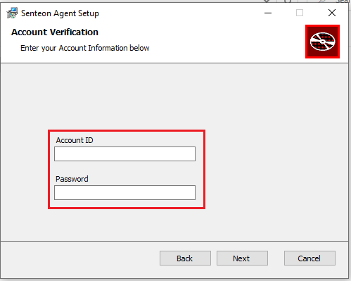

# Getting Started 

### Terminology

`Senteon Command Center` - The central administrator console

`Senteon Agent` - A small program installed on each endpoint that performs actions and communicates back to Command Center

`Master Account` - The primary account that you signed up for Senteon with. This account acts as a container for all of your users, data, and resources

`Managed Account` - A "sub-account" within the Master Account that you set up for each organization you wish to manage. Agents/endpoints are registered to Managed Accounts for administration

### Supported Operating Systems

**Senteon Command Center**
- Windows 10 Version 2004+
  - Pro and Enterprise (Not Home)
- Windows Server 2016 Version 2004+
- Windows Server 2019 Version 1809+

**Senteon Agent**
- Windows 10 Version 2004+
  - Pro and Enterprise (Not Home)

# Installation

## Please note there are 2 programs that need to be installed for Senteon to work. Please first follow the steps for installing Command Center, and then follow the steps to install the Senteon Agent.
### Command Center is used for central administration of Senteon.
### Senteon Agents are installed on every endpoint and are used to apply the policies and changes configured in Command Center.

For the purposes of the beta, Senteon has provided you with:
- Installer for Senteon Command Center
- Credentials for Senteon Command Center
- Managed Account ID and Registration Code

> **Note**: In full release, you will be able to create new Managed Accounts through Command Center. 

Senteon installation is divided into two separate stages that use different installers. The provided installer is for Command Center, the administrator console. After installing Command Center on the computer you wish to use for Senteon administration, the Senteon Agent installer will be created for you to deploy on your endpoints. Documentation for setting both up can be found below.

# Command Center Installation Steps

1) Transfer `SenteonCommandCenter.msi` onto the computer that is intended to be used as the central console and execute (double-click). 

2) Review and Accept the Senteon End-User License Agreement, then select `Next`.

3) Accept the UAC prompt that appears in the taskbar.

**Post-Install**

After Command Center has finished installing, it can be accessed by searching "Senteon Command Center" in Windows Search or directly at `C:\Program Files\Senteon\CommandCenter\SenteonCommandCenter.exe`.

# Senteon Agent Installation Steps

Inside the Command Center install directory (`C:\Program Files\Senteon\CommandCenter\` by default), there will be an additional .msi installer for the Senteon Agent called `SenteonAgent.msi`. This installer should be distributed and installed onto all systems that you intend to manage. 

**To install you will need:**

- `Managed Account ID` - ID/Name of Managed Account you wish to register the agent/endpoint to

- `Registration Code` - Registration code for Managed Account

**Steps**

1) Transfer `SenteonAgentInstaller.msi` onto the endpoint you want to manage and execute (double-click). 

2) Review and Accept the Senteon End-User License Agreement, then select `Next`.

3) Choose the folder where you want to install (`C:\Program Files\Senteon\SenteonAgent` by default)

4) Enter the requested details for the Managed Account you wish to register the endpoint to.

5) Accept the UAC prompt that appears in the taskbar.

**Post-Install**

After the installation is complete, the "Senteon Agent" service will be running on the endpoint. This service is configured to automatically restart if the computer is rebooted.

## Next Steps

In order to configure Senteon Agents to implement and manage your hardened settings, follow the instructions in [Configuring/Setting Up Endpoints](endpoint_setup.md).
